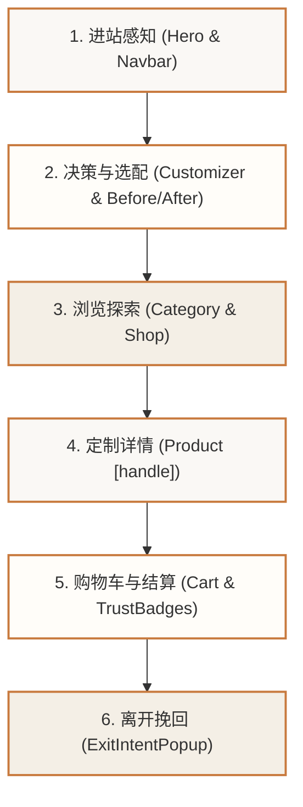

# 宠物油画独立站 · 前端全链路二次深度审查与多版本视觉方案

> **项目名称**：Cansoria 前端全面改造为「高端宠物油画独立站」  
> **视觉基调**：**白色奶油风（Warm White Cream Aesthetic）** —— 深度融合方案 B（温暖治愈）与方案 C（现代静奢）  
> **审查范围**：全站全链路（首页、分类页、商品详情、购物车、结算、退出弹窗、关于我们、全局样式与设计令牌）  
> **更新时间**：2026-10-06  

---

## 目录
1. [前端全链路二次深度审查结果 (Comprehensive Deep Audit)](#一前端全链路二次深度审查结果-comprehensive-deep-audit)
2. [多版本视觉方案全景与核心视觉图对比](#二多版本视觉方案全景与核心视觉图对比)
   - [版本 1：【B+C 黄金平衡版】治愈温情 × 现代静奢（推荐主推）](#版本-1bc-黄金平衡版治愈温情--现代静奢推荐主推)
   - [版本 2：【方案 B 强化版】温暖治愈系软奶油风](#版本-2方案-b-强化版温暖治愈系软奶油风)
   - [版本 3：【方案 C 强化版】现代当代艺术馆静奢风](#版本-3方案-c-强化版现代当代艺术馆静奢风)
   - [版本 4：【方案 A 轻复古版】法式画坊典雅风](#版本-4方案-a-轻复古版法式画坊典雅风)
3. [各页面深度改进与代码落地映射表](#三各页面深度改进与代码落地映射表)
4. [下一步代码执行与验证清单](#四下一步代码执行与验证清单)

---

## 一、 前端全链路二次深度审查结果 (Comprehensive Deep Audit)

在本次二次深度审查中，我们跳出单一首页，将审查范围拓展到 **“进站 -> 浏览 -> 选配 -> 详情 -> 加购 -> 结账 -> 离店挽留”** 的完整电商转化漏斗。



### 1. 深度审查发现的 7 个系统级断层：

1. **退出挽留弹窗（`ExitIntentPopup.tsx`）风格与业务脱节**：
   * **现状**：冷白底色（`bg-white`）、硬直角边框、聚焦高亮使用的是旧陶土色 `focus:border-terracotta`；
   * **问题**：文案仍是通用画室的 *"Get studio updates and member offers on custom paintings"*；
   * **改进方向**：升级为圆润奶白卡片（`bg-[#FFFDF9] rounded-3xl border border-border-subtle`），文案改为情感驱动型挽回：**“Don’t leave your fur baby’s portrait behind! Enjoy 15% off your first bespoke pet oil painting.”**
2. **全站页脚（`Footer.tsx`）设计风格滞后**：
   * **现状**：纯冷白底色（`bg-white border-t border-gray-200`），标题使用旧色 `text-terracotta`；
   * **问题**：内容全为旧版通用画作链接（风景、抽象等）；
   * **改进方向**：切换至燕麦奶油底（`bg-cream-card border-t border-border`），重塑为手绘宠物油画工作室专属介绍，链接精准对应狗、猫、多宠及纪念款。
3. **商店分类页（`shop/page.tsx` & `ShopHeader.tsx` & `ShopFilters.tsx`）仍为杂货店架构**：
   * **现状**：标题仍是 *"Shop Hand-Painted Oil Paintings - Discover landscapes, abstracts, wedding gifts..."*，分类仍包含风景画与抽象画；
   * **问题**：筛选器使用硬直角矩形按钮；
   * **改进方向**：主标改为 **“The Bespoke Pet Art Collection”**，分类全面收敛为宠物定制维度，筛选器升级为温润胶囊药丸（Pill buttons）配合焦糖色激活高亮。
4. **商品卡片（`ProductCard.tsx`）视觉硬化**：
   * **现状**：硬直角边框（`border border-charcoal/10 bg-white`），标签使用 `bg-terracotta` 与 `hover:border-muted-gold`；
   * **问题**：与整体奶油风的柔和治愈感形成强烈违和；
   * **改进方向**：统一为 `rounded-2xl` 温润圆角卡片、柔和燕麦底色 `bg-cream-light`、暖焦糖高亮标签 `bg-toffee`。
5. **商品详情页（`ProductActions.tsx`）缺乏核心定制交互与信任背书**：
   * **现状**：选项规格为直角纯黑块，无宠物定制专属功能；
   * **改进方向**：
     - 规格选项圆角化（`rounded-xl`）；
     - 增加 **爱宠照片上传指引卡片**（可下单后直接上传或邮件发送给专属画师）；
     - 增加 **“零风险承诺盒”**（出稿前无限制免费修改、不满意重新绘制、顺丰/国际空运保价礼盒）。
6. **购物车（`cart/page.tsx`）信任徽章（`TrustBadgeGrid.tsx`）未传达定制痛点**：
   * **现状**：通用的 "Secure checkout" / "Worldwide shipping"；
   * **改进方向**：强化宠物定制最核心的信任点：**“100% Artist Impasto Oil”**（非数码喷绘）、**“Free Proof Approval”**（满意才发货）、**“Museum Linen Canvas”**（百年不褪色）。
7. **关于我们页（`about/page.tsx`）品牌故事断层**：
   * **现状**：大量冷白背景与陶土色，文案仍为“为私人空间手绘艺术”；
   * **改进方向**：讲述“为什么我们专注宠物油画”——每一只宠物都是独一无二的家人，我们用匠人手作的油彩温度，替宠主留住毛孩子眼神里的光芒与爱。

---

## 二、 多版本视觉方案全景与核心视觉图对比

为了让您全方位对比不同设计偏向带来的视觉冲击与商业转化效果，我们为您梳理并提供了 **4 套多版本视觉图与设计解析**：

---

### 版本 1：【B+C 黄金平衡版】治愈温情 × 现代静奢（🔥 推荐主推）
> **“把毛孩子的灵魂光芒，化作现代奶油雅居里的传世艺术品。”**

```
┌────────────────────────────────────────────────────────────────────────┐
│  [CANSORIA]    Custom Portrait    Dog Art    Cat Art    Reviews   (Cart)│
├────────────────────────────────────────────────────────────────────────┤
│  ✦ BESPOKE PET OIL PORTRAITS                                            │
│  Capture Your Companion's Soul in Museum-Grade Oil Art                │
│  From casual phone snaps to rich impasto canvases.                    │
│                                                                        │
│  [ Start Custom Portrait → ]    [ View Pet Gallery ]                   │
│                                                                        │
│  ★ ★ ★ ★ ★ 4.9/5 · Loved by 12,000+ Pet Parents                        │
│                                                                        │
│  [ 阳光奶油客厅场景：天然橡木实木框挂画 · 金毛眼神灵动 · 真实厚涂肌理 ]    │
├────────────────────────────────────────────────────────────────────────┤
│  【3 步极简定制 (How It Works)】 1.上传照片 ➔ 2.手绘免费手稿确认 ➔ 3.礼盒到家│
├────────────────────────────────────────────────────────────────────────┤
│  【核心交互 1】照片 vs 博物馆级厚涂油画 Before / After 交互对比滑块     │
├────────────────────────────────────────────────────────────────────────┤
│  【核心交互 2】首页画框选配器 (天然橡木 / 复古黄铜 / 哑光黑框 / 纯画布)  │
└────────────────────────────────────────────────────────────────────────┘
```

* **设计核心**：
  * **背景基底**：马斯卡彭暖白（`#FAF8F5`）配合燕麦暖调（`#F4EFE6`），完全剔除冷白；
  * **行动按钮**：温暖焦糖太妃色（`#C87A3E`），悬浮为深焦糖（`#A55F28`）；
  * **构件语言**：`rounded-2xl`（16~24px）柔和圆角卡片，配合弥散暖调微投影；
  * **商业优势**：兼顾方案 B 的**低决策门槛**与方案 C 的**高客单溢价**（预期 AOV：$220 - $550）。

---

### 版本 2：【方案 B 强化版】温暖治愈系软奶油风
> **“温润奶香、软萌治愈、极简三步、情感共鸣至上”**


* **核心视觉特征**：
  * **配色**：香草纯牛奶白（`#FFFDF8`）+ 黄油饼干底（`#F8F2E7`）+ 暖焦糖（`#D9824B`）+ 蜜桃奶油（`#E8AC80`）；
  * **视觉主角**：憨态可掬的英短猫咪与活泼柯基，强调萌宠的情绪神态与蓬松毛发厚涂感；
  * **组件亮点**：
    * 带有微投影的独立 3 步卡片（Upload Photo ➔ Preview Art ➔ Delivered）；
    * 紧跟大面积 Before / After 照片转换油画对比模块；
    * 真实买家秀情绪评价：“Luna's portrait captures her cheeky personality perfectly!”；
  * **商业优势**：**转化率最高**，极度适合年轻一代宠主与节日/生日礼品冲动消费。

---

### 版本 3：【方案 C 强化版】现代当代艺术馆静奢风 (Quiet Luxury)
> **“大尺度留白、建筑光影、原木质感、懂品味的高级宅邸”**


* **核心视觉特征**：
  * **配色**：暖雪花石白（`#FBF9F5`）+ 燕麦天然亚麻（`#F2ECE2`）+ 画廊纯炭黑（`#201D1A`）+ 拉丝香槟金（`#C5A059`）；
  * **视觉主角**：大画幅贵族犬/优雅猫咪油画，挂在挑高空间、大面落地窗阳光洒落的侘寂奶油客厅；
  * **组件亮点**：
    * **交互式画框选配器（Interactive Frame Selector）**：天然原木橡木框（Natural Oak）、复古黄铜（Vintage Brass）、现代黑框（Black Gallery）、纯画布包裹（Canvas Wrap）一键实时预览；
    * 规格与尺寸芯片选择（12x16"、18x24"、24x36"），价格动态联动；
    * 100% 纯手绘博物馆级认证金牌徽章；
  * **商业优势**：**客单价最高（$300 - $1,200+）**，深受设计师、别墅大宅业主与高端艺术收藏买家青睐。

---

### 版本 4：【方案 A 轻复古版】法式画坊典雅风 (French Atelier)
> **“像卢浮宫名作一样的传世肖像，古典优雅与仪式感”**


* **核心视觉特征**：
  * **配色**：法式马斯卡彭白（`#FAF7F2`）+ 软亚麻底（`#F4EFE6`）+ 复古金箔（`#B88E4B`）+ 古典灰绿（`#7D8A78`）；
  * **视觉主角**：戴着复古领结的金毛犬，置于画室的实木画架与重工雕花金框中；
  * **组件亮点**：古典罗马衬线体标题、书签式藏家评价、画室画笔颜料实景置景。

---

## 三、 各页面深度改进与代码落地映射表

| 页面 / 模块 | 当前现状 | 目标改造规范 (B+C 融合) | 涉及核心文件 |
| :--- | :--- | :--- | :--- |
| **全站底色与设计系统** | 仍残留旧类名与冷白色块 | 全局统一为 `#FAF8F5` 马斯卡彭暖白与燕麦卡片系统 | `globals.css` |
| **全站页脚 Footer** | 冷白背景，通用画室文案与旧链接 | 改造为燕麦奶油底，宠物油画品牌故事与精准分类 | `Footer.tsx` |
| **商店分类页 /shop** | 包含风景/抽象等非宠物杂类，直角方块 | 全面收敛为 5 大宠物定制类目，温润圆角胶囊药丸筛选器 | `shop/page.tsx`, `ShopHeader.tsx`, `ShopFilters.tsx` |
| **商品卡片 ProductCard**| 生硬直角边框，旧色标签 | 升级为 `rounded-2xl`，柔和奶油底色与焦糖标签 | `ProductCard.tsx` |
| **商品详情页 /product** | 纯黑直角选项，无宠物定制保障 | 选项圆角化，增加爱宠照片上传指引与零风险手稿保障徽章 | `ProductActions.tsx`, `ProductInfo.tsx` |
| **购物车与结算 Cart** | 通用信任标未打消定制顾虑 | 强化 100% 手绘厚涂、发货前免费手稿确认、保价礼盒运输 | `cart/page.tsx`, `TrustBadgeGrid.tsx` |
| **挽回弹窗 Exit Popup** | 冷白硬角弹窗，通用优惠文案 | 升级为奶白大圆角卡片，聚焦爱宠肖像立减 15% 钩子 | `ExitIntentPopup.tsx` |
| **品牌故事页 /about** | 泛艺术工作室文案，大面积冷白 | 讲述专属手绘宠物油画的情感初衷与匠人精神 | `about/page.tsx` |

---

## 四、 下一步代码执行与验证清单

1. **执行全局清理**：批量清理全站 `terracotta`、`gray-200` 等遗留类名，绑定到奶油色板；
2. **重构关键页面组件**：按计划顺序改造 `Footer.tsx`、`ShopHeader.tsx`、`ShopFilters.tsx`、`ProductCard.tsx`、`ProductActions.tsx`、`ExitIntentPopup.tsx`；
3. **验证构建与类型安全**：执行 `npx tsc --noEmit` 和 `npm run build`，确保 0 报错并完成视觉自适应走查。
